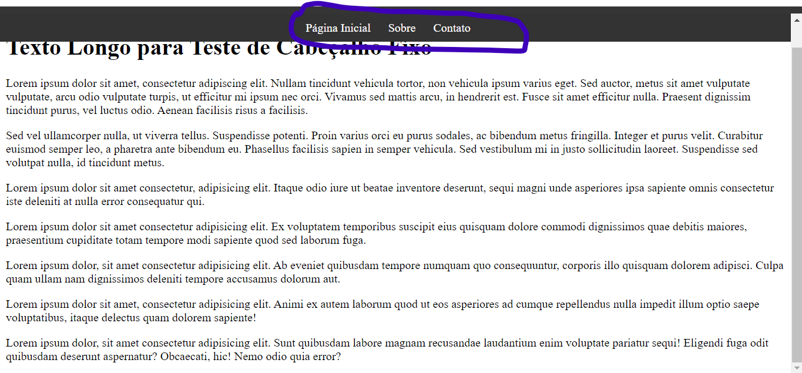

# CABEÇALHO FIXO
☑️UM CABEÇALHO FIXO É ÚTIL PARA MANTER O CABEÇALHO VISÍVEL NA PARTE SUPERIOR DA PÁGINA ENQUANTO O USUÁRIO ROLA O CONTEÚDO.

  

## DESCRIÇÃO:
Este código HTML e CSS cria uma página web com um cabeçalho fixo que contém uma navegação simples. A página contém um conteúdo extenso e inclui um exemplo de código JavaScript para rolagem suave ao clicar nos links da navegação.

O que o app faz:

1. **Cabeçalho Fixo:**
   - O cabeçalho é fixo no topo da página, utilizando a classe CSS `.header`.
   - Possui uma barra de navegação (`nav`) contendo links para "Página Inicial," "Sobre," e "Contato."
   - Estilizado com fundo escuro (`#333`), texto branco (`#fff`), e um preenchimento de 10 pixels.

2. **Conteúdo Principal:**
   - O conteúdo principal está contido dentro da `
` com o ID `content`.
   - Inclui um título (`<h1>`) e vários parágrafos (`
`) de texto de exemplo.

3. **Estilos CSS Adicionais:**
   - O arquivo de estilo externo (`CODIGO.css`) contém estilos para o cabeçalho, a navegação e uma margem superior no corpo para evitar sobreposição com o cabeçalho fixo.

4. **JavaScript para Rolagem Suave:**
   - Um trecho de código JavaScript (contido em `CODIGO.js`) é utilizado para permitir rolagem suave quando um link é clicado.
   - Quando um link é clicado, a página rola suavemente para a seção correspondente.

**Nota:**
- O código JavaScript utiliza a função `window.scrollTo` para controlar a rolagem suave, ajustando para a altura do cabeçalho fixo.
- Recomenda-se adicionar mais conteúdo à `
` com o ID `content` para testar o cabeçalho fixo com rolagem.

## NÃO SABE?
- Entendemos que para manipular arquivos em `HTML`, `CSS` e outras linguagens relacionadas, é necessário possuir conhecimento nessas áreas. Para auxiliar nesse aprendizado, oferecemos cursos gratuitos disponíveis:
* [CURSO DE HTML E CSS](https://github.com/VILHALVA/CURSO-DE-HTML-E-CSS)
* [CURSO DE JAVASCRIPT](https://github.com/VILHALVA/CURSO-DE-JAVASCRIPT)
* [CONFIRA MAIS CURSOS](https://github.com/VILHALVA?tab=repositories&q=+topic:CURSO)

## CREDITOS:
- [PROJETO CRIADO PELO VILHALVA](https://github.com/VILHALVA)